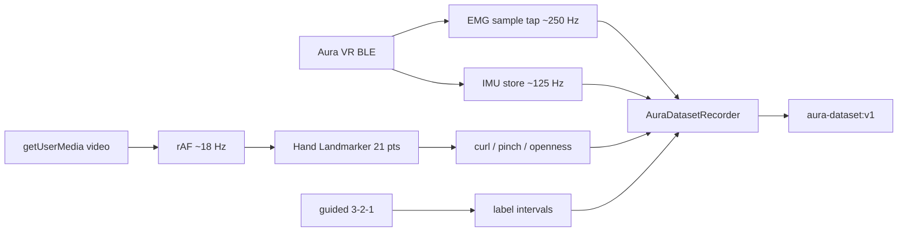

import { Callout, Cards } from 'nextra/components'

# Aura Dataset Lab

A labelled recording bench in the [experiences gallery](/software/features/experiences) for **Aura VR** (8-channel palm EMG + 6-axis IMU). Guided 3-2-1 writes rest/hold labels onto the EMG clock. Camera is optional QC or freeform autolabel. Optical is a vision estimate, not ground truth.

Open it from **cloud.pieeg.com** (or the self-hosted dashboard) → **`V`** → **Aura Dataset Lab**. Registry id: `aura-dataset-lab`. Badge: **Aura required**.

<Callout type="warning">
  Optical labels are a vision estimate, not ground truth. EMG, IMU, and camera clocks are independent. The 50 Hz table is last-sample-hold for alignment and label review: not a signal downsample, and not a file to compute EMG or IMU features from.
</Callout>

## What it is (and is not)

| It is | It is not |
|---|---|
| A labelled EMG + IMU session writer | A classifier or Hand Trainer replacement |
| Guided rest/hold intervals for the classes you pick | Wrist-flexion classes (IMU owns orientation) |
| Optional 21-point Hand Landmarker autolabel | MediaPipe GestureRecognizer (canned 7-class image model) |
| Native-rate JSON / ZIP export | A video file or pixel archive |
| Camera as QC or freeform labels | A second opinion that overwrites the guided cue |

Wear Aura on the wrist/palm. Opening the lab turns off bandpass, notch, and Hampel (same dashboard commands) so EMG is raw. The live dock is the dashboard ChannelCanvas on the same buffers; Session QC is recorded-file review after stop.

## Live loop



1. **Connect Aura** — 8-ch palm EMG at 250 Hz, LSM6DS3 IMU once per BLE notify (~125 Hz). Zero pose if the 3D hand is rotated off the wrist.
2. **Filters off** — `set_filter` / `set_notch` / `hampel_config` disabled on open. Header chip: `EMG RAW · filters off`.
3. **Guided or camera** — pick classes and follow HOLD, or enable the camera and move freely.
4. **3D hand** — IMU orients the mesh. Guided mode drives the cued grip. With no cue, optical curls drive the fingers.
5. **Live EMG dock** — dashboard ChannelCanvas + optional SpectralPanel. Not the recorded take until you stop.
6. **Export** — JSON (full streams) or ZIP (one CSV per stream at native rate + 50 Hz label table). Hard stop at 6 min (warn at 3 min).

## Three clocks

The three streams are **not** resampled onto each other at capture.

| Stream | Timestamp at ingest | Source | Typical rate |
|---|---|---|---|
| **EMG** | EEG frame `t` (Unix seconds) | `useEEG` per-sample tap (`window.__p300SampleHandler`) — same multiplexer P300 / BioPose use | ~250 Hz |
| **IMU** | `Date.now() / 1000` | Wall clock when `auraVrImuStore` publishes a new packet | ~125 Hz |
| **Optical** | `Date.now() / 1000` | Wall clock at the rAF detect | ~18 Hz (`OPTICAL_HZ`) |
| **Guided labels** | `Date.now() / 1000` | Same wall clock as IMU/optical when the phase label changes | interval |

On export, every timestamp is subtracted from `t0` (first recorded event). Export times start at `0`. The streams still have different rates and jitter.

```
emg:      t = frame.t          →  ~board rate (often 250 Hz)
imu:      t = Date.now()/1000  →  ~125 Hz, browser wall clock
optical:  t = Date.now()/1000  →  ~18 Hz, browser wall clock
```

That skew is real. Do not treat an EMG sample, an IMU packet, and an optical frame with the same exported `t` as simultaneous in the lab sense. They share a zero, not a hardware sync pulse.

<Callout type="info">
  Dashboard latency (`Date.now()/1000 - frame.t`) is the same class of offset. Aura Dataset Lab does not compensate it.
</Callout>

## Guided 3→2→1

Same timing as Hand Trainer / Face Trainer v2. Rest intervals are labelled `rest`. Hold intervals (including ramp-in and ramp-out) are labelled with the cued class. Camera, if on, is QC against the cue: it does **not** overwrite the guided label.

| Constant | Value |
|---|---|
| Countdown | 1 s (unlabelled) |
| Rest per cycle | 2.0 s (`rest` after 0.4 s) |
| Ramp up | 0.5 s (class label) |
| Hold | 2.0 s (class label) |
| Ramp down | 0.5 s (class label) |
| Rest final | 1.0 s (`rest` after 0.2 s) |
| Cycles per rep | 3, then 2, then 1 |
| Reps / class | 1–8 (default 3) |

Protocol:

1. Tick classes, set reps, **Start guided session**.
2. Get ready → rest (muscles off) → ramp in → **HOLD** (the label) → ramp out → rest.
3. Cycle numbers count down 3, 2, 1. Then the next class.
4. Rest means muscles off. Do not spread the fingers.

### Classes

Discrete EMG classes reuse Hand Trainer grips: large-amplitude, spatially distinct poses a palm 8-ch montage can plausibly separate. Wrist flexion/extension is absent on purpose.

| id | Cue | Why it is in the set |
|---|---|---|
| `fist` | Tight fist, wrist still | Finger flexors. Largest palm signal. |
| `open` | Fingers spread, wrist still | Extensors. Opposite spatial pattern to fist if anything sees the dorsal side. |
| `pinch` | Thumb to index, others relaxed | Thenar + FDS. Placement-dependent. |
| `point` | Index out, other three curled | Lateralised. May not separate from fist with no spatial contrast. |
| `thumb-up` | Thumb up, fingers loosely curled | Thenar. Dark channel importance means no thenar pickup. |
| `rest` | Hand loose, muscles off | Negative class for EMG. **Not** an optical class. |

`rest` is a guided cue. A camera cannot reliably tell rest from a gentle open hand, so optical never emits `rest`.

## Camera autolabel

MediaPipe **Hand Landmarker** (21 points, world landmarks in metres). Not GestureRecognizer.

1. **Enable camera** — `facingMode: "user"`, ideal 640×480, no audio. Overlay is mirrored.
2. **Hand Landmarker** — MediaPipe Tasks Vision, float16 model, `VIDEO` mode, one hand. GPU delegate first, CPU fallback. WASM from jsDelivr `@mediapipe/tasks-vision@0.10.34`.
3. **Detect** — `requestAnimationFrame` gated to **18 Hz**.
4. **Geometry** — per-finger curl (PIP/IP joint angle), pinch (thumb-index / palm width), openness (1 − mean of four-finger curls), thumb-up (extended thumb, curled fingers, tip above wrist).
5. **Decide** — score fist / open / pinch / point / thumb-up from those features. Winner needs `conf ≥ 0.55` and margin `≥ 0.1`. Below that, or no hand: unlabelled.
6. **Smooth** — hold 4 agreeing frames before switching class (kills 1-frame flicker).
7. **Custom class** — snapshot a named pose into a 7-D running-mean vector (`thumb, index, middle, ring, pinky, pinch, openness`). Matched by L2 distance. Stored in `localStorage` key `aura-dataset-lab:custom-v1`. An optical prototype is not an EMG class until you export and train.

Aura on the wrist/palm often occludes the hand from a laptop camera. Hidden palm → unlabelled row. Lighting and clock skew apply.

## How review / QC lines them up

**Session QC** is recorded-file review of the 50 Hz last-sample-hold table. It is not the live traces.

Live QC (guided + camera on) compares optical frames to guided intervals:

| Gate | Rule |
|---|---|
| Optical used | `present`, `classId` set, `conf ≥ 0.6` |
| Guided used | interval has a class other than `rest` |
| Agree | `optical.classId === guided.classId` |

Header shows `agree / compared`. Vision estimate, not a validation metric you should threshold science on.

The 50 Hz synced table (`SYNC_HZ = 50`) walks `t` from first EMG sample to now:

| Field | Lookup |
|---|---|
| EMG | Last EMG sample with `emgT ≤ t` |
| IMU | Last IMU sample with `imuT ≤ t` (no max-dt drop) |
| Optical | Last optical sample with `optT ≤ t`, **only if** `t − optT ≤ 0.12 s` |
| Label | Guided interval if any, else optical class |
| `qc_agree` | Set only when guided class is not `rest` and optical has a class |

Nyquist of that table is 25 Hz. No anti-alias filter. Do not compute EMG or IMU features from it. Native-rate CSVs are the signal files.

## Take format `aura-dataset:v1`

Capture stays in per-stream arrays. On export, timestamps relativize to session start.

```json
{
  "format": "aura-dataset:v1",
  "created_at": "2026-09-18T12:00:00.000Z",
  "duration_sec": 84.2,
  "sample_rate_emg": 250,
  "sync_hz": 50,
  "channels": 8,
  "imu_units": { "accel": "g", "gyro": "dps", "euler": "deg" },
  "label_source": "hybrid",
  "classes": ["fist", "open", "pinch", "point", "thumb-up", "rest"],
  "caveats": [
    "Optical labels are a vision estimate, not ground truth.",
    "Aura on the wrist/palm can occlude the hand from the laptop camera.",
    "EMG, IMU, and camera clocks are independent; synced rows use last-sample hold.",
    "6-axis IMU, no magnetometer: yaw drifts. Euler is a complementary-filter estimate.",
    "Guided rest is a cue (muscles off). Optical cannot reliably tell rest from a gentle open hand."
  ],
  "counts": {
    "emg": 21050,
    "imu": 10520,
    "optical": 1512,
    "events": 40,
    "qc_compared": 800,
    "qc_agree": 610
  },
  "events": [{ "t": 1.02, "type": "hold_start", "classId": "fist", "source": "guided" }],
  "intervals": [{ "start": 3.1, "end": 5.6, "classId": "fist", "source": "guided" }],
  "emg": [[0.0000, 12.3, ...8 ch], ...],
  "imu": [[0.008, ax, ay, az, gx, gy, gz, roll, pitch, yaw], ...],
  "optical": [{ "t": 0.05, "present": true, "classId": "fist", "conf": 0.81, "...": "..." }]
}
```

`label_source` is `guided`, `optical`, `hybrid`, or `none`. Optional JSON extras (off by default):

| Checkbox | Field | Cost |
|---|---|---|
| Include 21-point landmarks | `optical[].landmarks` as 63 floats (`x,y,z` × 21, image space) | Large |
| Include 50 Hz synced table | `synced[]` | Large; same join as the ZIP label CSV |

### EMG packing

`emg[i] = [t, ch1…ch8]` — same µV values the dashboard already shows, padded to 8. `sample_rate_emg` is whatever `getSampleRate()` reports at export. It is metadata, not a resampling step.

### IMU packing

`imu[i] = [t, ax, ay, az, gx, gy, gz, roll, pitch, yaw]`. Accel in g, gyro in dps, Euler in degrees from the complementary filter in `auraVrImuStore` (gyro + accel tilt; yaw from gyro only). 6-axis, no magnetometer: yaw drifts.

### Optical packing

Per frame: `t`, `present`, `score`, `handedness`, `classId`, `conf`, `reason`, five curls, `pinch`, `openness`, `thumbUp`, optional `landmarks`. Camera pixels are not stored.

### ZIP files

Filename: `aura_dataset_YYYYMMDD_HHMMSS.zip`.

| File | Content |
|---|---|
| `emg_{rate}hz.csv` | Native-rate EMG. `t`, `ch1`…`ch8` µV. The signal file. |
| `imu.csv` | Native-rate IMU. Accel g, gyro dps, Euler deg. |
| `optical.csv` | Vision label estimate (~15–20 Hz). Not ground truth. |
| `labels_synced_50hz.csv` | 50 Hz last-sample-hold join. **Not** signal data. |
| `events.json` | Cue and label events, seconds from start. |
| `intervals.json` | Guided `[start, end, classId]`. Label source of truth for guided sessions. |
| `meta.json` | Rates, caveats, counts, file guide. |

JSON filename: `aura_dataset_YYYYMMDD_HHMMSS.json`.

## Controls

| Input | Action |
|---|---|
| **Start guided session** | Record + 3-2-1 queue for selected classes |
| **Record with camera labels** | Freeform; optical labels the stream (camera must be on) |
| **Stop** | Close the open interval; keep the take |
| **Show** | 3D demo of that grip (not recorded) |
| **Snapshot / Refine** | Custom optical prototype |
| **Zero pose** | Subtract current Euler as the 3D-hand origin |
| **Export JSON / ZIP** | Download; clears the crash-recovery slot |
| **Session QC** | Review the 50 Hz table of the current take |
| **Clear session** | Drop the take and the recovery slot |
| **Esc** | Exit gallery |

A new Start appends to the same recorder until you Clear. Warn at 3 min. Hard stop at 6 min (`MAX_DURATION_SEC`).

## Crash recovery

EEG/EMG is biometric. Recovery is a net, not an archive:

- One IndexedDB slot (`aura-dataset-lab` / `last`).
- Written on unmount if the take has samples; rewritten on Stop.
- Surfaced on next open. Download JSON or discard.
- Purged on export, clear, discard, and after 24 h.
- Origin-local. Nothing is uploaded.

## Limits

- Aura VR only (8-ch palm EMG + LSM6DS3). Demo source `demo:auravr` is synthetic.
- Laptop / phone camera, one hand, ~18 Hz. Occlusion from the device on the wrist is expected.
- No magnetometer on the IMU this lab reads; yaw drifts. Euler is a complementary-filter estimate.
- Rest is a cue. Optical cannot see EMG and cannot see rest vs a gentle open hand.
- Wrist pose is IMU, not an EMG class.
- Three clocks, last-sample hold, no hardware sync pulse.
- Custom optical classes are geometry prototypes, not trained EMG detectors.

## Related

<Cards>
  <Cards.Card title="Experiences gallery" href="/software/features/experiences" />
  <Cards.Card title="BioPose Recorder" href="/software/features/biopose" />
  <Cards.Card title="Recording & Replay" href="/software/features/recording" />
  <Cards.Card title="Dashboard" href="/software/features/dashboard" />
</Cards>
