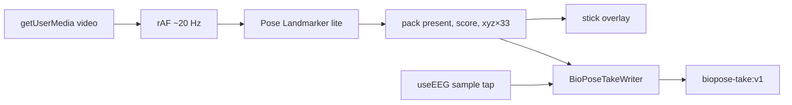

import { Callout, Cards } from 'nextra/components'

# BioPose Recorder

A live split bench in the [experiences gallery](/software/features/experiences): camera + 33-point body stick on the left, live bio traces on the right. Record writes both streams into one take. Review plays the points. Camera pixels never leave the tab.

Open it from **cloud.pieeg.com** (or the self-hosted dashboard) → **`V`** → **BioPose Recorder**. Registry id: `biopose-recorder`.

<Callout type="warning">
  Pose is a monocular vision estimate, not mocap. Bio and camera clocks are independent. Import plays points, not video.
</Callout>

## What it is (and is not)

| It is | It is not |
|---|---|
| A free recorder of two streams | A classifer, protocol, or dataset wizard |
| 33 MediaPipe body landmarks | A face mesh or hand tracker |
| Whatever bio is already on the live stream | A new acquisition path |
| Points + timestamps + optional marks | A video file |

Bio is the connected board — face, scalp, palm, demo, anything `useEEG` is already writing. Camera-only takes are valid: pose records, bio stays empty.

## Live loop



1. **Enable camera** — `facingMode: "user"`, ideal 960×720, no audio. Video is mirrored (`scaleX(-1)`).
2. **Pose Landmarker** — MediaPipe Tasks Vision, lite float16 model, `VIDEO` mode, one pose. GPU delegate first, CPU fallback. WASM from jsDelivr `@mediapipe/tasks-vision@0.10.34`.
3. **Detect** — `requestAnimationFrame` gated to **20 Hz** (`POSE_HZ`). `detectForVideo(video, performance.now())`.
4. **Pack** — image landmarks, 33 × `(x, y, z)`, normalised 0–1. World landmarks are **not** stored; they only bump `score` to `1` when present (`0.8` if image-only, `0` if absent).
5. **Draw** — body stick (torso, arms, legs). Face mesh is omitted on purpose.
6. **Bio traces** — the live ring buffer, same amplitude scale as the dashboard. Not the recorded take until you stop.

If a pose tick arrives more than `2.4 ×` the 20 Hz budget late while recording, that frame is counted as **dropped** and not written.

## Two clocks

The two streams are **not** resampled onto each other at capture.

| Stream | Timestamp at ingest | Source |
|---|---|---|
| **Bio** | EEG frame `t` (Unix seconds) | `useEEG` per-sample tap (`window.__p300SampleHandler`) — same multiplexer P300 / Aura Dataset Lab use |
| **Pose** | `Date.now() / 1000` | Wall clock at the rAF detect |
| **Marks (live)** | `Date.now() / 1000` | Same wall clock as pose |
| **Marks (review)** | playhead `t` | Shared take clock after relativization |

On **Stop**, every timestamp is subtracted from `t0` (first recorded event). Export times start at `0`. The streams still have different rates and jitter.

```
bio:  t = frame.t          →  ~board rate (often 250 Hz)
pose: t = Date.now()/1000  →  ~20 Hz, browser wall clock
```

That skew is real. Do not treat a pose frame and a bio sample with the same exported `t` as simultaneous in the lab sense. They share a zero, not a hardware sync pulse.

<Callout type="info">
  Dashboard latency (`Date.now()/1000 - frame.t`) is the same class of offset. BioPose does not compensate it.
</Callout>

## How review lines them up

Review has **one playhead**. It does not interpolate pose.

| Lookup | Rule |
|---|---|
| `bioIndexAt(t)` | Last bio sample with `bioT ≤ t` (clamped to the stream) |
| `poseIndexAt(t)` | Last pose sample with `poseT ≤ t`, **only if** `t − poseT ≤ 0.15 s`. Otherwise no stick. |

So the body hold-last-samples for up to 150 ms, then goes blank. Click the traces to seek on the bio clock. The scrubber and marks sit on the same relative seconds.

## Take format `biopose-take:v1`

Capture stays in typed-array chunks so a long session does not allocate a JS object per sample.

| Constant | Value |
|---|---|
| Bio chunk | 4096 frames |
| Pose chunk | 512 frames |
| Pose stride | `2 + 33×3 = 101` floats |
| Warn | 12 min |
| Hard stop | 20 min |

On stop, chunks flatten into one contiguous take:

```json
{
  "format": "biopose-take:v1",
  "created_at": "2026-09-17T12:00:00.000Z",
  "sample_rate": 250,
  "channels": 8,
  "duration_sec": 12.4,
  "caveats": [
    "Monocular pose is a vision estimate, not mocap.",
    "Bio and camera clocks are independent; review uses last-sample hold.",
    "Camera pixels are not stored. Import plays points, not video.",
    "Occlusion, clothing, and framing drop pose frames."
  ],
  "events": [{ "t": 3.21, "text": "reach" }],
  "bio": { "t": [0, 0.004, ...], "ch": [/* frame-major, channels packed */] },
  "pose": { "t": [0.02, 0.07, ...], "packed": [/* stride 101 per frame */] }
}
```

### Pose packing (one frame)

| Offset | Meaning |
|---|---|
| `0` | `present` (`1` / `0`) |
| `1` | `score` |
| `2 … 100` | landmark `i` → `x, y, z` at `2 + i×3` |

Image space, not metres. `x, y` in `[0, 1]` of the camera frame (mirrored on draw). `z` is MediaPipe’s image-relative depth, not world coordinates.

### Bio packing

`bio.ch[frame * channels + ch]` — same µV values the dashboard already shows. `sample_rate` is whatever `getSampleRate()` reports at stop (default 250 if unset). It is metadata, not a resampling step.

### Export

JSON is assembled as **Blob parts** in 2000-number slices. There is no `JSON.stringify` of the whole session. Precision: bio `t` 6 decimals, bio values 2, pose `t` 6, packed pose 5.

Filename: `biopose_YYYYMMDD_HHMMSS.json`.

Import accepts that object only (`format` must be `biopose-take:v1`, lengths must match `channels` and stride 101).

## Controls

| Input | Live | Review |
|---|---|---|
| **Space** | Record / Stop | Play / Pause |
| **M** / Mark | Wall-clock event on the writer | Event at the playhead |
| **Esc** | Exit gallery | Back to live (take kept) |
| Click traces | — | Seek to that bio sample |
| Export / Import | Import only | Both |

A new Record resets the writer. The previous take stays on screen until then.

## Honest limits

- Laptop / phone camera, one body, lite model, ~20 Hz.
- Occlusion, clothing, tight framing, and a late rAF drop pose frames (`Dropped` meter).
- No magnetometer, no mocap suit, no pixel archive, no class labels.
- Clocks are independent; 150 ms hold is a viewer convenience, not alignment.
- Score is a presence hint, not a quality metric you should threshold science on.

## Code

| File | Role |
|---|---|
| `cloud/src/experiences/biopose-recorder/BioPoseRecorder.tsx` | Split bench, live / review, HUD |
| `cloud/src/experiences/biopose-recorder/pose.ts` | Landmarker, pack, stick draw |
| `cloud/src/experiences/biopose-recorder/take.ts` | Writer, clocks, JSON blob |
| `cloud/src/experiences/biopose-recorder/sampleTap.ts` | EEG per-sample multiplexer |

## Related

<Cards>
  <Cards.Card title="Experiences gallery" href="/software/features/experiences" />
  <Cards.Card title="Recording & Replay" href="/software/features/recording" />
  <Cards.Card title="Data format" href="/software/api/data-format" />
  <Cards.Card title="Dashboard" href="/software/features/dashboard" />
</Cards>
